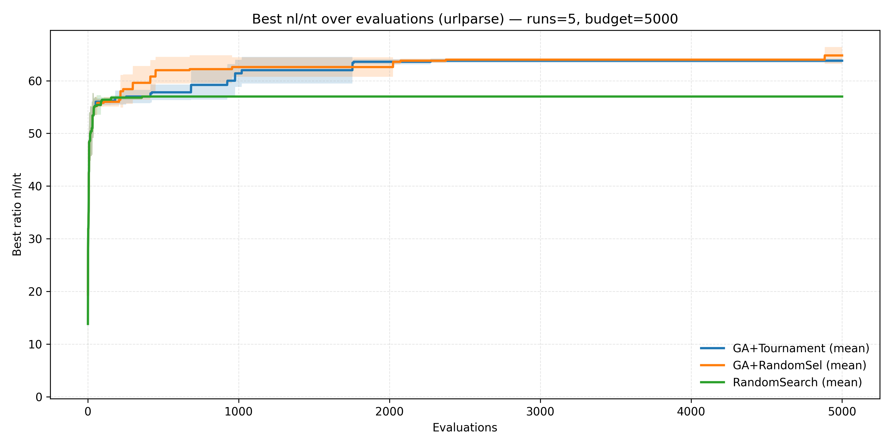
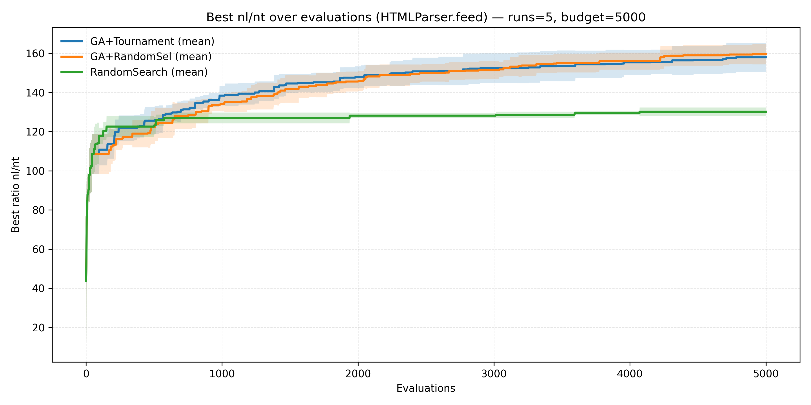

# HIV_2024_TP3
This repository contains the assignment 32 for the students of the LOG6305 course

This fork extends the provided baseline (in `optimize.py` + `poly_sbst/`) with two tailored test-suite generators:

- **Q1**: `urllib.parse.urlparse`
- **Q2**: `html.parser.HTMLParser().feed`

## Report metadata (fill in)

- Course: LOG6305
- Practical work: TP3
- Student: *(your name + student ID)*
- Date: 2026-02-28
- Python: 3.10+ (this code uses `X | Y` type hints, so Python <3.10 will not work)
- Dependencies: `pymoo==0.6.1`, `matplotlib`
- Reproducibility seed used in the example results: `--seed 123`

The goal is to **maximize line coverage** while keeping the **test suite as small as possible**, using the single-objective metric:

- `ratio = nl/nt`
  - `nl`: number of unique lines covered in the SUT module
  - `nt`: number of tests (scenarios) in the candidate test suite

Because Pymoo solves minimization problems by default, we optimize `F = -ratio`.

## Assignment tasks (what was required)

### Q1 — Testing `urllib.parse.urlparse`

- Implement:
  - `UrlTestSuiteGenerator` (randomized inputs; grammar recommended)
  - `UrlTestSuiteProblem` (fitness based on coverage vs suite size)
  - `UrlTestSuiteMutation` and `UrlTestSuiteCrossover`
- Use GA with a budget of **5000 evaluations**, suites of **≤ 40 tests**, and run at least **5 runs**
- Compare GA with:
  - `TournamentSelection` vs `RandomSelection`
  - `TournamentSelection` vs `RandomSearch`
- Plot convergence: **best-so-far `nl/nt` vs evaluations**
- Deliver code in **`url optimize.py`**

### Q2 — Testing `HTMLParser().feed`

- Same as Q1 but for `html.parser.HTMLParser().feed`
- Deliver code in **`html optimize.py`**

### Q3 — Choose best configuration

- For each SUT, select the best configuration (highest coverage with the lowest number of tests)
- Report the **best maximal `nl/nt`** achieved across 5 runs (respecting the 5000 eval budget)

### Q4 — If using LLMs

- Explain how an LLM could help (grammar design, mutators, parameter tuning, report writing)

## Repository layout

- `optimize.py`: baseline example from the starter code
- `Optimize.py`: convenience wrapper to run `optimize.py` (matches the PDF name)
- `tp3/`
  - `tp3/shared.py`: shared generator/problem/mutation/crossover utilities
  - `tp3/url.py`: URL-specific grammar + classes + wrapper executor
  - `tp3/html.py`: HTML-specific grammar + classes + wrapper executor
- `url optimize.py` / `html optimize.py`: required deliverable scripts (perform the required comparisons + plots)
- `url_optimize.py` / `html_optimize.py`: same scripts, but with import-friendly filenames

## Running the optimizers

- Requirements: Python 3.10+ with `pymoo==0.6.1` and `matplotlib`.
- (Recommended) Create a venv and install deps:
  - `python3 -m venv .venv && . .venv/bin/activate`
  - `python -m pip install -U pip`
  - `python -m pip install pymoo==0.6.1 matplotlib`

## Checklist (consign / requirements)

- ✅ Did not modify the provided Abstract* classes (`poly_sbst/` is unchanged)
- ✅ Budget respected: default `--budget 5000` evaluations (termination by `n_eval`)
- ✅ Suite size constraint: each individual is a suite with `1 <= nt <= 40`
- ✅ GA used and compared over ≥5 runs: default `--runs 5`
- ✅ GA(TournamentSelection) vs GA(RandomSelection): plotted best-so-far `nl/nt` vs evaluations
- ✅ GA(TournamentSelection) vs RandomSearch: included and plotted
- ✅ Code delivered in the required filenames: `url optimize.py` and `html optimize.py`

### Baseline example (starter code)

- `python3 Optimize.py` (or `python3 optimize.py`)

### Q1: urlparse

- `python3 url_optimize.py` (or `python3 'url optimize.py'`)

### Q2: HTMLParser.feed

- `python3 html_optimize.py` (or `python3 'html optimize.py'`)

Both scripts default to `--runs 5 --budget 5000 --pop-size 50` and write:
- Best suites under `results/` (one `*_best_suite.txt` per config × run)
- A convergence plot under `plots/` (saved at 300 DPI)
- A machine-readable `summary.json` under the corresponding `results/<sut>/` folder

`results/` and `plots/` are ignored by git (see `.gitignore`).

Tip: pass `--seed <int>` for reproducible runs (the scripts seed both `numpy.random` and Python’s `random`).

## Exporting as a PDF report

If you want a PDF deliverable from this Markdown report:

1. Run the optimizers to generate the figures under `plots/`
2. Convert Markdown → PDF (example with Pandoc):
   - `pandoc README.md -o report.pdf`

## Experimental setup (used for the report)

The scripts default to the assignment budget and run count:

- `runs = 5`
- `budget = 5000` evaluations (`termination=("n_eval", budget)`)
- `pop_size = 50`
- suite size constraint: `1 <= nt <= 40`

The convergence plots show **mean ± std** over the 5 runs.

## How inputs are represented

The framework expects each test to be a **single string** (because `AbstractExecutor` calls the SUT with one argument).
To support multiple parameters, each fuzzer uses a lightweight **string encoding**.

### urlparse encoding

Format: `ALLOW|SCHEME|URL`

- `ALLOW`: `"0"` or `"1"` → passed as `allow_fragments` to `urlparse`
- `SCHEME`: default scheme string (can be empty) → passed as `scheme` to `urlparse`
- `URL`: the actual URL string

Example:

- `1|http|http://example.com/path?x=1#frag`

Implementation: `tp3/url.py:urlparse_driver`.

### HTMLParser.feed encoding

Format: `FLAG|HTML`

- `FLAG`: `"0"` or `"1"` → passed as `convert_charrefs` to `HTMLParser(convert_charrefs=...)`
- `HTML`: the HTML document fragment passed to `parser.feed(...)`

Example:

- `0|
hello
`

Implementation: `tp3/html.py:html_feed_driver`.

## How coverage is computed

Coverage is measured with `sys.settrace()` in `poly_sbst/common/abstract_executor.py`.
We count **unique executed line numbers** in the target module:

- urlparse: `urllib.parse`
- HTML parsing: `html.parser`

The objective uses only `nl = |covered_lines|` (unique lines), not branch/edge coverage.

## Test-suite generator (population sampling)

Each individual is a **test suite**: a `numpy.ndarray[str]` of size `nt` with `1 <= nt <= 40`.

Sampling is **grammar-based** (plus seeds):

- URL grammar: `tp3/url.py:URL_GRAMMAR`
- HTML grammar: `tp3/html.py:HTML_GRAMMAR` (uses placeholder brackets to avoid `<nonterminal>` conflicts, then post-processes)

To align with the “minimize number of tests” objective and to keep evaluations fast, suite lengths are **biased toward small sizes**
via an exponent in `tp3/shared.py:GrammarSuiteGenerator.generate_random_test`.

## Fitness function (Problem)

Implemented in `tp3/shared.py:RatioCoverageProblem` (subclassed by:
`tp3/url.py:UrlTestSuiteProblem` and `tp3/html.py:HTMLTestSuiteProblem`).

For a candidate suite:

1. Execute all tests under tracing
2. Compute `nl = number_of_unique_covered_lines`
3. Compute `nt = number_of_tests_in_suite`
4. Return fitness `F = -(nl/nt)`

The best-so-far `nl/nt` value is tracked at **each evaluation** to build convergence curves.

## Variation operators

### Mutation

Implemented in `tp3/shared.py:SuiteMutation` (subclassed by
`tp3/url.py:UrlTestSuiteMutation` and `tp3/html.py:HTMLTestSuiteMutation`).

Suite-level mutations (randomly chosen):

- delete / insert / replace a test
- mutate a single test string (domain-specific mutators)
- shuffle suite order
- de-duplicate tests (stable unique)

Domain-specific string mutators include:

- URL: delimiter insertion, percent-encoding, scheme separator breaking/fixing, unicode insertion, flag toggling, etc.
- HTML: tag/snippet insertion, entity insertion, breaking tag delimiters, attribute noise, flag toggling, etc.

### Crossover

Implemented in `tp3/shared.py:OnePointSuiteCrossover` (subclassed by
`tp3/url.py:UrlTestSuiteCrossover` and `tp3/html.py:HTMLTestSuiteCrossover`).

One-point crossover splices two parent suites at random cut points, then:

- de-duplicates tests
- repairs length constraints (`1..40`) by truncating or adding generated tests

## Algorithms and required comparisons

Both `url_optimize.py` and `html_optimize.py` compare (over `--runs`, default 5):

1. `GA` with `TournamentSelection`
2. `GA` with `RandomSelection`
3. `RandomSearch` (baseline)

Termination is by evaluation count: `termination=("n_eval", budget)` (default `budget=5000`).

The scripts produce a convergence plot of **best-so-far `nl/nt` vs evaluations**, with mean ± std over runs.

## Results produced by the scripts

After a run, look at:

- `results/urlparse/summary.json` and `plots/urlparse_convergence.png`
- `results/htmlparser/summary.json` and `plots/htmlparser_convergence.png`

Each `summary.json` includes per-run best `(ratio, lines, tests)` for each configuration plus aggregated stats.

## Results (example run for the report)

These results were generated on **2026-02-28** with:

- `python3 'url optimize.py' --seed 123`
- `python3 'html optimize.py' --seed 123`

### Q1 — urlparse (summary)

Configuration performance (best ratio per run, aggregated over 5 runs):

| Config | Best max `nl/nt` | Mean best `nl/nt` | Std |
|---|---:|---:|---:|
| GA + TournamentSelection | 64.0 | 63.8 | 0.4 |
| GA + RandomSelection | 68.0 | 64.8 | 1.6 |
| RandomSearch | 57.0 | 57.0 | 0.0 |

Convergence plot:

**Best configuration (Q3, urlparse):** `GA+RandomSel`

- Best max ratio: **68.0**
- Best run artifact: `results/urlparse/GA+RandomSel_run4_best_suite.txt`

### Q2 — HTMLParser.feed (summary)

Configuration performance (best ratio per run, aggregated over 5 runs):

| Config | Best max `nl/nt` | Mean best `nl/nt` | Std |
|---|---:|---:|---:|
| GA + TournamentSelection | 167.0 | 158.0 | 7.43 |
| GA + RandomSelection | 166.0 | 159.6 | 5.24 |
| RandomSearch | 134.0 | 130.2 | 2.14 |

Convergence plot:

**Best configuration (Q3, HTMLParser.feed):** `GA+Tournament`

- Best max ratio: **167.0**
- Best run artifact: `results/htmlparser/GA+Tournament_run2_best_suite.txt`

Notes:

- In these runs, the best suites often have `nt=1`, so `nl/nt` equals `nl` for the best solution.
- For grading, always treat `summary.json` as the source of truth (it records the run seeds + exact best values).

## Discussion

- **GA vs RandomSearch:** for both SUTs, GA consistently finds higher `nl/nt` than RandomSearch within the same 5000-evaluation budget.
- **Tournament vs Random selection:** performance depends on the SUT:
  - urlparse: `GA+RandomSel` reached the best max ratio (68.0) in these runs.
  - HTMLParser.feed: `GA+Tournament` reached the best max ratio (167.0) in these runs.
- **Metric behavior:** because the objective is `nl/nt`, solutions with very small suites (often `nt=1`) can dominate if they already achieve high coverage; this matches the assignment’s “few tests” goal but can trade off against absolute coverage if adding tests does not add enough new lines.

## Q4 (LLM usage idea)

If using an LLM to help with the assignment, a practical workflow would be:

1. Ask it to propose/extend grammars and seed corpora targeting tricky URL/HTML corner cases
2. Ask it to propose domain-specific mutation operators (e.g., percent-encoding, broken tag syntax)
3. Use it to interpret convergence plots and suggest parameter tweaks (pop size, mutation rate, suite length bias)
4. Use it to draft the report sections describing design choices and to summarize numeric results into tables
